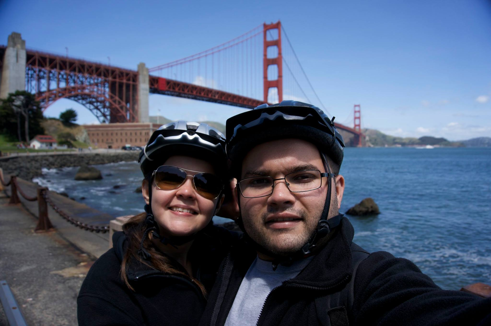



[Currículo Lattes](http://lattes.cnpq.br/1676762016268778)

Professor em Teoria da Computação:

- [IFCE- Campus Avançado de Aracati](http://aracati.ifce.edu.br/):
  - Rua Teófilo Pinto, 200 - Farias Brito, Aracati - CE, 62.800-000, Brasil
  - +55 88 3421-3559

<!--Doutorando em Ciência da Computação:

- [Universidade Federal do Ceará](http://www.mdcc.ufc.br)
  - Campus do Pici - Bloco 910, Fortaleza - CE, 60.455-760, Brasil
  - +55 85 3366-9847-->

## Áreas de Interesse

- [Algoritmos](http://en.wikipedia.org/wiki/Algorithm)
- [Teoria dos Grafos](http://en.wikipedia.org/wiki/Graph_theory)
- [Otimização Combinatória](http://en.wikipedia.org/wiki/Combinatorial_optimization)
- [Competições de Programação](http://en.wikipedia.org/wiki/Competitive_programming)

## Formação Acadêmica

<!--- [Doutor em Ciência da Computação pela UFC](http://www.ufc.br/) *(em progresso)*-->
- [Mestre em Ciência da Computação pelo IME-USP (2012)](http://www.ime.usp.br/)
- [Bacharel em Ciência da Computação pela UECE (2008)](http://www.uece.br/)
- [Técnico em Desenvolvimento de Software pelo IFCE (2004)](http://www.ifce.edu.br/)

<!--
## Posts

<ul class="posts">
  
    <li>{{ post.date | date_to_string }} &raquo; <a href="{{ BASE_PATH }}{{ post.url }}">{{ post.title }}</a></li>
  
</ul>
-->
